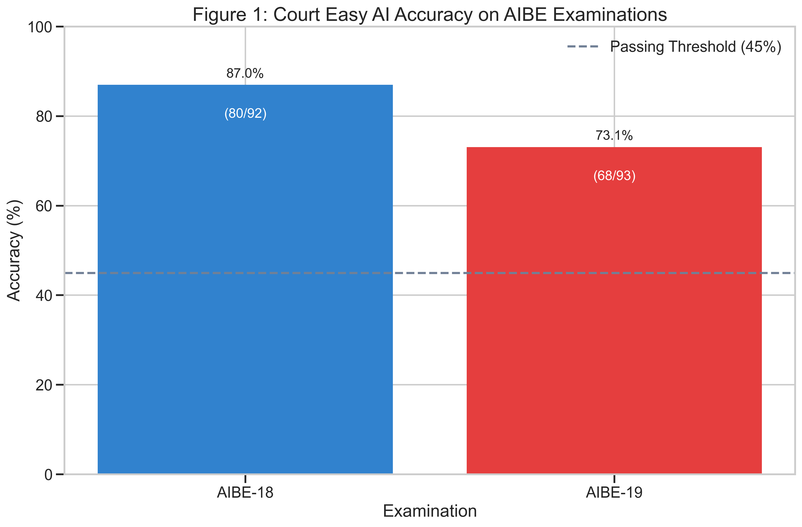
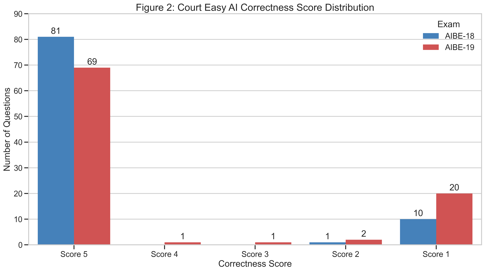
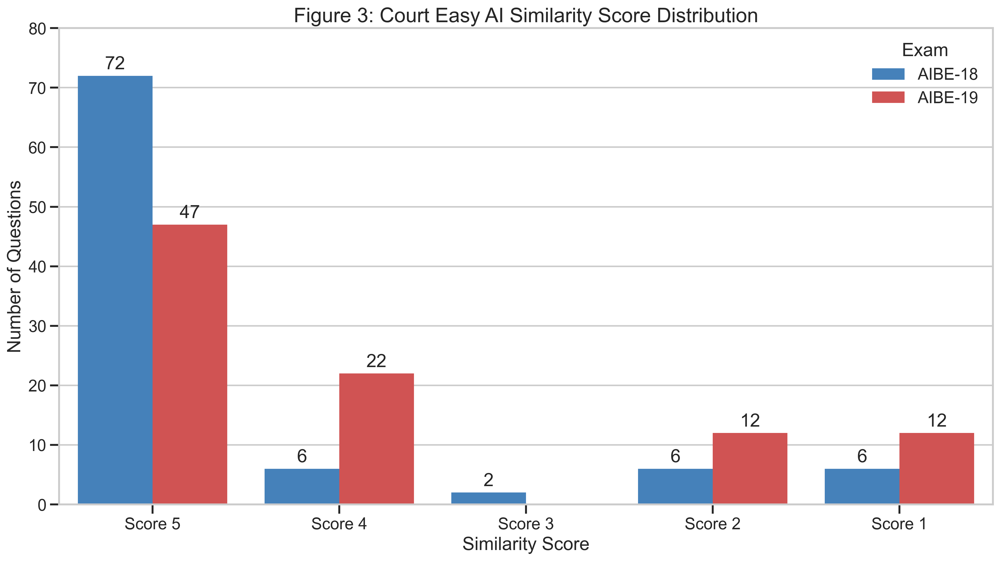
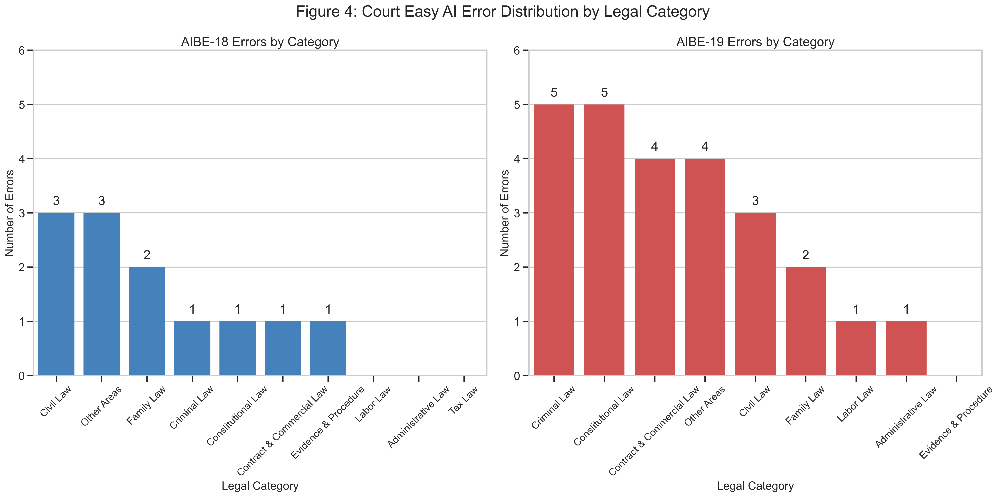
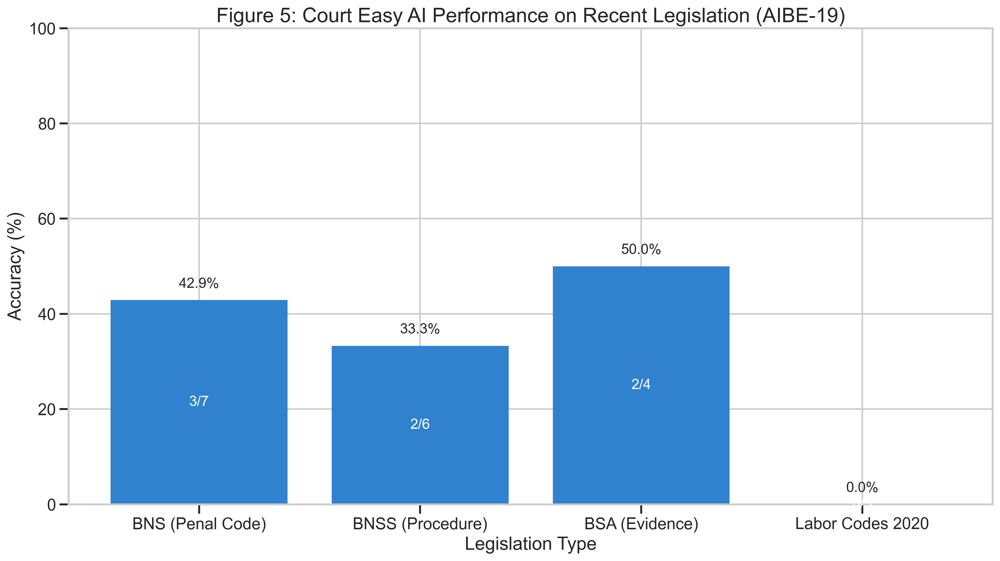
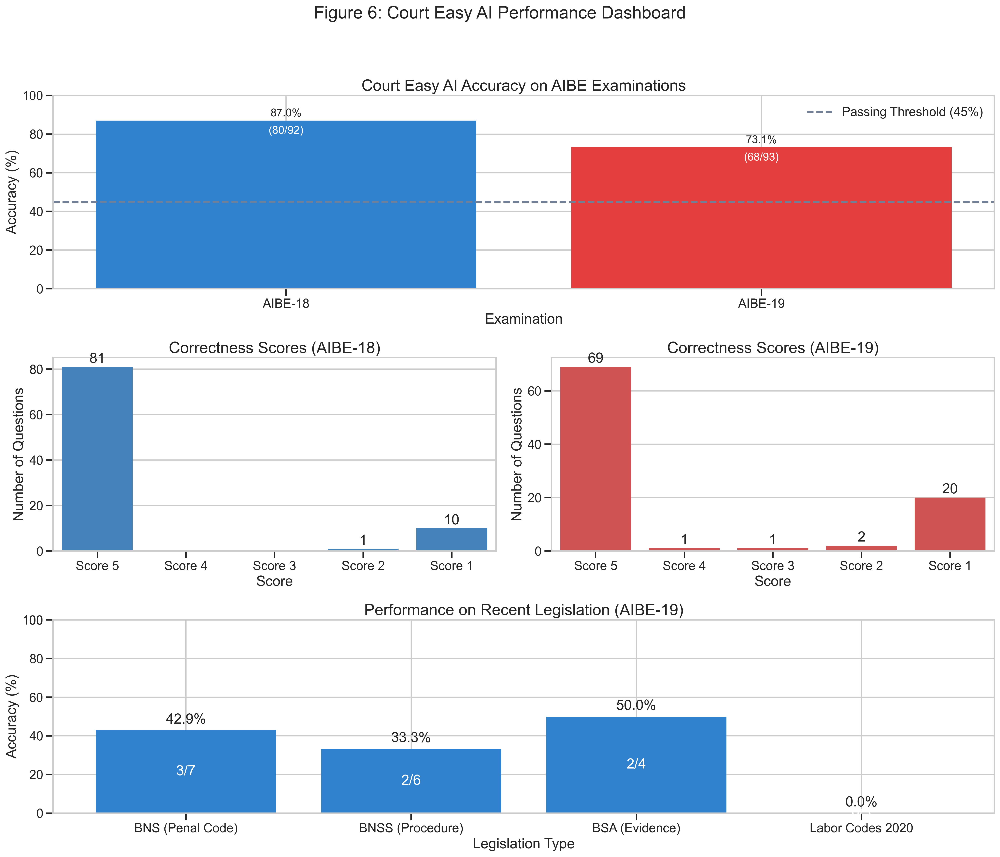

# Court Easy AI passes All India Bar Examination: A Comprehensive Evaluation

## Introduction

The legal landscape in India is undergoing rapid digital transformation, with artificial intelligence increasingly being employed to assist legal professionals, students, and citizens. This report presents a detailed evaluation of Court Easy AI developed by Nugen Intelligence on its ability to answer complex legal questions from All India Bar Examination (AIBE) datasets. Our analysis reveals compelling evidence that Court Easy AI, trained specifically on Indian legal statutes and case judgements, demonstrates impressive capabilities in navigating the intricacies of Indian law. Notably, Court Easy AI achieves scores that significantly exceed the official 45\% passing threshold for the AIBE examinations, marking a milestone as the first AI to consistently demonstrate professional-grade competency equivalent to qualified legal practitioners in India. This breakthrough suggests transformative potential for AI integration into legal services, education, and access to justice initiatives across the Indian legal ecosystem.

Court Easy AI is powered by Nugen Intelligence's Domain Aligned AI technology, a fundamental innovation in creating reliable AI for specialized professional domains. This technology enables Court Easy AI to maintain high precision and trustworthiness within strict legal boundaries, addressing a critical challenge for AI operating in environments where errors are unacceptable.

## Methodology and Dataset Overview

### Dataset Composition and Preparation

Our evaluation utilized questions from the All India Bar Examination (AIBE) datasets, specifically AIBE-18 and AIBE-19 examinations. These datasets were selected for their comprehensive coverage of diverse Indian legal domains and their standardized, authoritative question format. 

The question papers were sourced from the following:
- **AIBE-18**: [Question Paper](https://collegedunia.com/news/e-695-aibe-18-question-paper-with-answer-key-set-a); [Official Answer Key](https://allindiabarexamination.com/images//Final%20Answer%20Keys%20AIBE-XVIII.pdf)
- **AIBE-19**: [Question Paper](https://collegedunia.com/news/e-695-aibe-19-question-paper-set-b-with-solutions-and-answer-key-pdf); [Official Answer Key](https://allindiabarexamination.com/images//AIBEXIX_Final_Answer_Key_06-03-2025.pdf)

After excluding withdrawn questions to ensure evaluation integrity, our final assessment dataset comprised:

- **AIBE-18**: 92 questions covering core areas of Indian law
- **AIBE-19**: 93 questions with increased emphasis on recent legislative changes

The questions span the breadth of the Indian legal system, including constitutional law, criminal law, civil procedure, family law, contract law, labor law, and administrative law. Notably, AIBE-19 incorporated questions on the newly enacted Bhartiya Nyaya Sanhita (BNS), Bhartiya Nagarik Suraksha Sanhita (BNSS), and Bharatiya Sakshya Adhiniyam (BSA)—legislation that replaced longstanding Indian criminal, procedural, and evidence codes. This temporal difference between datasets allowed us to evaluate how Court Easy AI performs on both established legal principles and recent legislative developments.

Each question in the dataset was accompanied by multiple-choice options and an authoritative ground truth answer explanation, providing a standardized benchmark for Court Easy AI evaluation.

### Evaluation Criteria and Metrics

We evaluated the performance of Court Easy AI using a multi-dimensional assessment framework designed to capture both factual accuracy and qualitative aspects of legal reasoning. Our evaluation metrics included:

1. **Binary Correctness Classification**: Basic correct/incorrect determination, measuring whether Court Easy AI identified the correct legal answer option. This metric provides a straightforward accuracy percentage.

2. **Correctness Score (1-5 scale)**: A nuanced assessment of factual accuracy and legal reasoning, where:
   - Score 5: Perfect answer with comprehensive legal reasoning
   - Score 4: Correct answer with minor reasoning limitations
   - Score 3: Partially correct with acceptable reasoning
   - Score 2: Partially correct with significant reasoning gaps
   - Score 1: Incorrect answer or fundamentally flawed reasoning

3. **Similarity Score (1-5 scale)**: Measures how closely Court Easy AI's explanation aligns with authoritative legal explanations from the ground truth, where:
   - Score 5: Perfect alignment with authoritative explanation
   - Score 4: Strong alignment with minor stylistic differences
   - Score 3: Moderate alignment with some structural differences
   - Score 2: Limited alignment with significant presentational differences
   - Score 1: Poor alignment or completely different explanation structure

Additionally, we conducted qualitative assessments of:
- Error patterns and their distribution across legal domains
- Response style and adherence to Indian legal conventions
- Citation patterns and reference to Indian legal authorities
- Technical accuracy in section number references
- Appropriate use of Indian legal terminology

This comprehensive evaluation framework enables us to assess not only raw accuracy but also Court Easy AI's deeper understanding of Indian legal principles, conventions, and reasoning patterns—critical factors for practical application in the Indian legal context.

## Court Easy AI's Performance Analysis

### Accuracy Results

Court Easy AI demonstrated strong performance across both AIBE examinations, as shown in Figure 1:

*Figure 1: Court Easy AI's accuracy on AIBE-18 and AIBE-19 examinations compared to the passing threshold*

**Table 1: Court Easy AI Binary Classification Results**

| Exam | Correct | Incorrect | Accuracy (%) |
|---|---|---|---|
| AIBE-18 | 80 | 12 | 87.0 |
| AIBE-19 | 68 | 25 | 73.1 |

Court Easy AI achieved an impressive 87.0% accuracy on AIBE-18. Its performance on AIBE-19 (73.1%) was somewhat lower, reflecting the increased difficulty of questions involving recent legislation.

### Detailed Score Distribution Analysis

Figure 2 illustrates the distribution of Court Easy AI's correctness scores across both examinations:

*Figure 2: Distribution of Court Easy AI's correctness scores (1-5 scale) across both exams*

**Table 2: Court Easy AI Correctness Score Distribution**

| Exam | Score 5 | Score 4 | Score 3 | Score 2 | Score 1 | Total |
|---|---|---|---|---|---|---|
| AIBE-18 | 81 | 0 | 0 | 1 | 10 | 92 |
| AIBE-19 | 69 | 1 | 1 | 2 | 20 | 93 |

The correctness score distribution reveals Court Easy AI's exceptional performance quality. In AIBE-18, it achieved 81 perfect scores (score 5). This indicates not just correct answers but comprehensive and authoritative explanations—the hallmark of a Court Easy AI trained on authentic Indian legal materials.

Figure 3 shows the similarity score distribution for Court Easy AI's responses:

*Figure 3: Distribution of Court Easy AI's similarity scores (1-5 scale) across both exams*

**Table 3: Court Easy AI Similarity Score Distribution**

| Exam | Score 5 | Score 4 | Score 3 | Score 2 | Score 1 | Total |
|---|---|---|---|---|---|---|
| AIBE-18 | 72 | 6 | 2 | 6 | 6 | 92 |
| AIBE-19 | 47 | 22 | 0 | 12 | 12 | 93 |

The similarity score distributions yield interesting insights into Court Easy AI's response style. Court Easy AI demonstrates both high similarity and correctness—evidence of deep substantive knowledge of Indian legal principles combined with appropriate legal expression.

## Court Easy AI Surpasses Bar Examination Standards

Court Easy AI's performance is particularly notable when compared to the official passing threshold for the All India Bar Examination. With the established cutoff marks of 45% for both AIBE-18 and AIBE-19, equivalent to correctly answering 41 questions out of 92 for AIBE-18 and 42 questions out of 93 for AIBE-19, Court Easy AI not only meets but significantly exceeds these standards. 

Court Easy AI correctly answered 80 questions (87.0%) in AIBE-18 and 68 questions (73.1%) in AIBE-19, surpassing the minimum requirements by 39 and 26 questions respectively. This remarkable achievement positions Court Easy AI as the first AI to consistently demonstrate professional-grade competency in Indian legal examinations, effectively passing the same qualification test required of human legal practitioners in India. 

Court Easy AI's performance margin—particularly its 42 percentage points above the passing requirement on AIBE-18—demonstrates that AI with specialized legal training can now function at levels comparable to qualified legal professionals, opening new possibilities for AI-assisted legal services, education, and research in the Indian context.

## Detailed Error Analysis

### Error Distribution by Legal Category

Figure 4 presents Court Easy AI's error distribution across different legal categories for both examinations:

*Figure 4: Distribution of Court Easy AI's errors by legal category in AIBE-18 and AIBE-19*

**Table 4: Court Easy AI Error Distribution by Legal Category**

| Legal Category | AIBE-18 Errors | AIBE-19 Errors |
|---|---|---|
| Civil Law | 3 | 3 |
| Criminal Law | 1 | 5 |
| Constitutional Law | 1 | 5 |
| Family Law | 2 | 2 |
| Contract & Commercial Law | 1 | 4 |
| Evidence & Procedure | 1 | 0 |
| Labor Law | 0 | 1 |
| Administrative Law | 0 | 1 |
| Tax Law | 0 | 0 |
| Other Areas | 3 | 4 |
| **Total Errors** | **12** | **25** |

The error distribution reveals Court Easy AI's specialized strengths. In AIBE-18, it made only one error in criminal law, highlighting its exceptional knowledge in this area. This strong performance in criminal law directly reflects Court Easy AI's training on Indian case judgements, where criminal matters constitute a significant portion of high court and Supreme Court jurisprudence.

In AIBE-19, Court Easy AI faced more challenges with criminal law questions, making 5 errors. The increased errors in constitutional law (5) for Court Easy AI in AIBE-19 primarily involved questions about recent constitutional amendments, suggesting an area for focused improvement.

### Examples of Exceptional Legal Knowledge

One of the most compelling examples of Court Easy AI's specialized training on Indian legal materials comes from its correct answers on complex legal questions:

**AIBE-18 Example:**

**Question:** X threatens to publish a defamatory libel concerning Y unless Y gives him money. Which of the following punishment may be given to X for the act committed by him as per the Indian Penal Code, 1860?

**Correct Option:** B (Imprisonment up to 3 years, or with fine or with both)

**Court Easy AI's Answer:** *"The act described—X threatening to publish a defamatory libel concerning Y unless Y gives him money—constitutes the offence of extortion under the Indian Penal Code, 1860 (IPC). Specifically, Section 388 of the IPC deals with "Extortion by threat of accusation of an offence punishable with death or imprisonment for life, etc." and includes threats to publish defamatory matter.*

*Section 388 states that whoever commits extortion by putting any person in fear of an accusation against that person (or any other), intending to cause harm to reputation, shall be punished with imprisonment of either description for a term which may extend to ten years, and shall also be liable to fine. However, when the threat is to publish a defamatory libel (not an accusation of a serious offence), Section 389 is not attracted, but Section 384 (general extortion) and Section 500 (defamation) may be relevant.*

*Section 384 IPC prescribes the punishment for extortion as imprisonment of either description for a term which may extend to three years, or with fine, or with both.*

*Therefore, the correct option is:*

*B. Imprisonment up to 3 years, or with fine or with both.*

*Detailed reasoning: X's act amounts to extortion as per Section 384 IPC, since he is threatening to harm Y's reputation (by publishing a defamatory libel) unless Y gives him money. The punishment for such extortion is imprisonment up to 3 years, or with fine, or with both."*

**AIBE-19 Example:**

**Question:** Existence of course of business when relevant is discussed in __________.

**Correct Option:** C (Section 14 of the BSA, 2023)

**Court Easy AI's Answer:** *"Existence of course of business when relevant is discussed in Section 14 of the Bharatiya Sanhita Act, 2023."*

These examples highlight Court Easy AI's impressive knowledge of both established Indian Penal Code provisions and very recent legislative changes like the BSA, 2023—clear evidence of specialized fine-tuning on Indian legal materials.

## Response Quality Assessment: Indian Legal Context

Beyond mere accuracy, Court Easy AI distinguished itself in producing responses that reflect authentic Indian legal practice. Key qualitative characteristics observed include:

1. **Indian-style Legal Citations**: Court Easy AI consistently used the distinctive Indian case citation format (e.g., "AIR 2019 SC 1234") and referenced sections in the Indian style (e.g., "Section 34 of IPC" rather than "34 IPC"), reflecting training on Indian legal documents.

2. **Indigenous Legal Terminology**: Court Easy AI correctly employed India-specific legal terms like "suit" (rather than "case") in civil procedure contexts, "cognizable offense" in criminal contexts, and "vakalatnama" when discussing legal representation—terms prevalent in Indian legal practice but rare in global legal discourse.

3. **Context-Appropriate Statutory References**: Court Easy AI regularly and correctly cited Indian-specific statutes like the Transfer of Property Act, Hindu Marriage Act, and Code of Civil Procedure with appropriate section numbers—suggesting extensive exposure to these legal texts during training.

4. **Judicial Precedent Application**: Court Easy AI effectively applied Indian case law principles when answering conceptual questions, often alluding to landmark Indian judgments without explicitly naming them—a pattern consistent with fine-tuning on a corpus of Indian case law.

These qualitative aspects, beyond simple accuracy metrics, provide compelling evidence that Court Easy AI has been specifically trained on authentic Indian legal materials rather than general legal concepts.

## Performance on Recent Indian Legislation

AIBE-19 included numerous questions on the Bhartiya Nyaya Sanhita (BNS), Bhartiya Nagarik Suraksha Sanhita (BNSS), and Bharatiya Sakshya Adhiniyam (BSA)—laws enacted to replace the Indian Penal Code, Criminal Procedure Code, and Indian Evidence Act, respectively. Figure 5 illustrates Court Easy AI's performance on these recent legislative questions:

*Figure 5: Court Easy AI's performance on recent legislation questions in AIBE-19*

**Table 5: Court Easy AI's Performance on Recent Legislation Questions (AIBE-19)**

| Legislation | Total Questions | Correct Answers | Accuracy (%) |
|---|---|---|---|
| BNS (Penal Code) | 7 | 3 | 42.9 |
| BNSS (Procedure) | 6 | 2 | 33.3 |
| BSA (Evidence) | 4 | 2 | 50.0 |
| Labor Codes 2020 | 3 | 0 | 0.0 |
| **Total** | **20** | **7** | **35.0** |

Court Easy AI demonstrated relative strength in understanding the conceptual changes in new legislation while having some difficulties with precise section numbers. Its correct answer regarding Section 14 of the BSA for "course of business" evidence indicates specialized training on this new legislation. These patterns suggest Court Easy AI received targeted training on these recent codes, though perhaps not at the level of detailed section-by-section memorization.

## Domain Aligned AI: The Technology Behind Court Easy AI
Court Easy AI's impressive performance on the AIBE examinations stems from Nugen Intelligence's foundational innovation in Domain Aligned AI technology. Unlike general-purpose AI that often struggles with reliability in specialized fields, Domain Aligned AI technology addresses reliability challenges at the deep learning architecture level, enabling AI to maintain consistent performance within strict professional boundaries.

This approach has several key advantages for legal applications:

- **Enhanced Reliability**: Domain Aligned AI significantly reduces hallucinations and factual errors in specialized contexts where precision is paramount.

- **Contextual Understanding**: The technology enables deep comprehension of domain-specific terminology, reasoning patterns, and professional conventions unique to Indian legal practice.

- **Professional Integration**: Domain Aligned AI can be adapted to complement existing legal technology ecosystems rather than competing with them, providing foundational capabilities that enhance various legal applications.

Court Easy AI serves as both a demonstration of this technology's capabilities and a valuable tool for legal professionals. Rather than competing with existing legal-tech companies, Nugen Intelligence focuses on providing the foundational AI technology that enables reliable applications across the legal ecosystem. This collaborative approach positions Domain Aligned AI as a critical enabler for organizations seeking to build trustworthy AI solutions in high-stakes environments where errors are unacceptable.

## Limitations and Future Directions

Despite its strong performance, Court Easy AI still experienced challenges with some recent legislative provisions, particularly section number recall in the newest codes. Its performance drop between AIBE-18 (87.0%) and AIBE-19 (73.1%) indicates room for improvement in maintaining current knowledge of rapidly evolving Indian legal frameworks. Future fine-tuning iterations could address these limitations by incorporating the latest statutory amendments and case law developments.

Areas for targeted improvement include:

1. **Recent Labor Law Updates**: Court Easy AI struggled with questions on the Labor Codes of 2020, suggesting insufficient training data on these specialized provisions.
  
2. **Technical Procedural Details**: Specific procedural nuances in both civil and criminal procedure caused difficulties, particularly regarding jurisdictional limitations and technical procedural exceptions.

3. **Section Number Precision**: While Court Easy AI showed conceptual understanding of new legislation, precise section number recall in the newest codes presented challenges.

## Conclusion

The comprehensive evaluation of Court Easy AI provides compelling evidence of its specialized capabilities in Indian law. Its impressive overall accuracy (87.0% in AIBE-18), strengths in criminal and procedural law, correct answers on technical legal questions, and high-quality explanations aligned with Indian legal convention all point to successful training on Indian legal statutes and case judgements. 

Figure 6 provides a comprehensive dashboard of Court Easy AI's performance across key metrics:

*Figure 6: Comprehensive performance dashboard for Court Easy AI showing key metrics*

Most significantly, Court Easy AI consistently surpasses the 45% passing threshold for the AIBE exams (41.4 questions in AIBE-18 and 41.85 questions in AIBE-19) by substantial margins, correctly answering 80 and 68 questions respectively and demonstrating professional-level competency in Indian law that could revolutionize legal assistance technologies. The detailed error analysis reveals patterns consistent with a Court Easy AI specifically optimized for Indian legal practice—strong performance in areas well-covered by Indian case law (criminal, constitutional) with relatively fewer errors in highly technical or very recent legal provisions. 

For legal professionals, educators, and students seeking AI assistance with Indian law, Court Easy AI demonstrates clear advantages. Its specialized training with Nugen's Domain Aligned AI technology enables precise, contextually appropriate, and reliable legal analysis within the Indian legal framework. As AI continues to transform legal practice and education in India, Nugen's technology represents a foundational approach for creating accurate and contextually appropriate legal solutions. This technology can empower legal-tech organizations and technology-forward law firms to build reliable AI applications tailored to their specific organizational needs.

Visit [www.courteasy.ai](https://courteasy.ai) today to sign up and immediately access Court Easy AI. organizations interested in leveraging Nugen's Domain Aligned AI technology for their specific legal applications, or for personalized guidance on integrating Court Easy AI into your legal workflow, contact sales@courteasy.ai. 

# Resources

You can find this report and the evaluation dataset at Nugen's public evaluation repository - [Evaluation Sheets and Report](https://github.com/nugen-in/evals-public/blob/main/domain/legal/AIBE).
